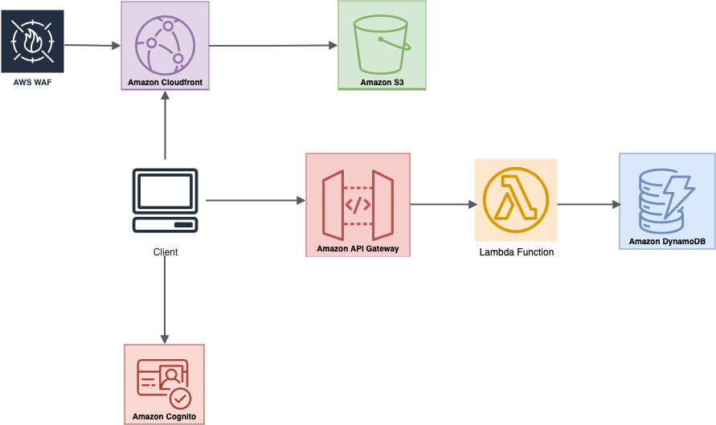

# Serverless ClickCounter WebApp on AWS

This project demonstrates a secure and scalable **serverless web application architecture** on AWS, combining a static frontend with an authenticated backend and cloud-native alerting features.


##  Architecture Overview




### Detailed Architecture

For a complete breakdown of all AWS services, configurations, and security settings, see [architecture.md](./architecture.md).

#### Architecture & Contributions

“Frontend HTML template used; backend integration, AWS services setup, and serverless architecture implemented and configured manually.”

**Key Components:**

- **S3 + CloudFront:** static hosting of the frontend with CDN acceleration (S3 bucket is pubblic because it hosts a static website)
- **WAF (Web Application Firewall):** protects CloudFront from malicious IPs and ensure rate limit to prevent attacks.
- **Cognito User Pool:** user authentication and token generation
- **API Gateway:** exposes the backend as a REST API with Cognito-based authorization
- **Lambda:** handles logic to update click counts and trigger alerts
- **DynamoDB:** NoSQL table for storing click counts
- **CloudWatch + SNS:** monitors suspicious activity and sends notifications

## Web App Access

You can access the public web app via the following CloudFront link:
[https://dtn4bsrr7bbyf.cloudfront.net/](https://dtn4bsrr7bbyf.cloudfront.net/)

## Login with Amazon Cognito

The app uses Amazon Cognito for user authentication.

To log in, you can use one of the following test accounts:

Username: testuser1@example.com

Password: PasswordTest123!!

##  Security Features

- API Gateway access protected using Amazon Cognito JWT tokens and custom throttling rules (rate & burst limits)
- AWS WAF applied to CloudFront to block malicious IPs and enforce rate-based rules (100 requests per 5 minutes per IP)
- CloudWatch Alarms and SNS notifications alert on suspicious traffic or WAF rule matches

##  File Structure
```text
/frontend --> Static website files (HTML, JS, Cognito integration)
/backend --> Lambda function code
/screenshots --> AWS console screenshots 
```
##  How to Deploy

This is a manual deployment project (no IaC yet). Main steps:

1. Upload frontend files to S3, enable static hosting
2. Set up CloudFront with S3 origin and WAF association
3. Configure Cognito User Pool and App Client
4. Create REST API in API Gateway with Cognito authorizer
5. Create Lambda function, grant necessary permissions
6. Set up DynamoDB table for click storage
7. Define WAF rules and CloudWatch alarms

##  AWS Console Screenshots

You can find all the screenshots organized by service
in the folder: [screenshots](./screenshots/)

##  Technologies Used

- Amazon S3, CloudFront, WAF
- AWS Lambda, API Gateway, DynamoDB
- Amazon Cognito
- Amazon CloudWatch + SNS

##  Learning Outcome

- Designing real-world serverless architecture
- Secure API development with JWT authorization
- Alerting and logging integration via native AWS services
- Full end-to-end authentication and data handling in the cloud
